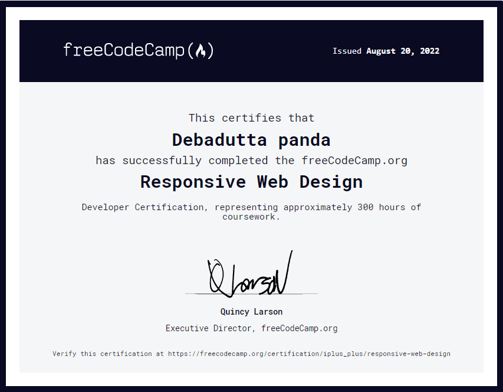

# Responsive Web Design Certification By free Code Camp

## Projects List

|Sl no|Project Task|Solution|Live Site|
|----|--------|---------|---------|
|1|Build a Survey Form|[<?xml version="1.0" ?><svg class="feather feather-external-link" fill="none" height="15" stroke="currentColor" stroke-linecap="round" stroke-linejoin="round" stroke-width="2" viewBox="0 0 24 24" width="'5" xmlns="http://www.w3.org/2000/svg"><path d="M18 13v6a2 2 0 0 1-2 2H5a2 2 0 0 1-2-2V8a2 2 0 0 1 2-2h6"/><polyline points="15 3 21 3 21 9"/><line x1="10" x2="21" y1="14" y2="3"/></svg>](https://github.com/debadutta98/freecodecamp-certification/tree/master/certification-project-1)|[<?xml version="1.0" ?><svg class="feather feather-external-link" fill="none" height="15" stroke="currentColor" stroke-linecap="round" stroke-linejoin="round" stroke-width="2" viewBox="0 0 24 24" width="'5" xmlns="http://www.w3.org/2000/svg"><path d="M18 13v6a2 2 0 0 1-2 2H5a2 2 0 0 1-2-2V8a2 2 0 0 1 2-2h6"/><polyline points="15 3 21 3 21 9"/><line x1="10" x2="21" y1="14" y2="3"/></svg>](https://debadutta98.github.io/freecodecamp-certification/certification-project-1)
|2|Build a Tribute Page|[<?xml version="1.0" ?><svg class="feather feather-external-link" fill="none" height="15" stroke="currentColor" stroke-linecap="round" stroke-linejoin="round" stroke-width="2" viewBox="0 0 24 24" width="'5" xmlns="http://www.w3.org/2000/svg"><path d="M18 13v6a2 2 0 0 1-2 2H5a2 2 0 0 1-2-2V8a2 2 0 0 1 2-2h6"/><polyline points="15 3 21 3 21 9"/><line x1="10" x2="21" y1="14" y2="3"/></svg>](https://github.com/debadutta98/freecodecamp-certification/tree/master/certification-project-2)|[<?xml version="1.0" ?><svg class="feather feather-external-link" fill="none" height="15" stroke="currentColor" stroke-linecap="round" stroke-linejoin="round" stroke-width="2" viewBox="0 0 24 24" width="'5" xmlns="http://www.w3.org/2000/svg"><path d="M18 13v6a2 2 0 0 1-2 2H5a2 2 0 0 1-2-2V8a2 2 0 0 1 2-2h6"/><polyline points="15 3 21 3 21 9"/><line x1="10" x2="21" y1="14" y2="3"/></svg>](https://debadutta98.github.io/freecodecamp-certification/certification-project-2)
|3|Build a Technical Documentation Page|[<?xml version="1.0" ?><svg class="feather feather-external-link" fill="none" height="15" stroke="currentColor" stroke-linecap="round" stroke-linejoin="round" stroke-width="2" viewBox="0 0 24 24" width="'5" xmlns="http://www.w3.org/2000/svg"><path d="M18 13v6a2 2 0 0 1-2 2H5a2 2 0 0 1-2-2V8a2 2 0 0 1 2-2h6"/><polyline points="15 3 21 3 21 9"/><line x1="10" x2="21" y1="14" y2="3"/></svg>](https://github.com/debadutta98/freecodecamp-certification/tree/master/certification-project-3)|[<?xml version="1.0" ?><svg class="feather feather-external-link" fill="none" height="15" stroke="currentColor" stroke-linecap="round" stroke-linejoin="round" stroke-width="2" viewBox="0 0 24 24" width="'5" xmlns="http://www.w3.org/2000/svg"><path d="M18 13v6a2 2 0 0 1-2 2H5a2 2 0 0 1-2-2V8a2 2 0 0 1 2-2h6"/><polyline points="15 3 21 3 21 9"/><line x1="10" x2="21" y1="14" y2="3"/></svg>](https://debadutta98.github.io/freecodecamp-certification/certification-project-3)
|4|Build a Product Landing Page|[<?xml version="1.0" ?><svg class="feather feather-external-link" fill="none" height="15" stroke="currentColor" stroke-linecap="round" stroke-linejoin="round" stroke-width="2" viewBox="0 0 24 24" width="'5" xmlns="http://www.w3.org/2000/svg"><path d="M18 13v6a2 2 0 0 1-2 2H5a2 2 0 0 1-2-2V8a2 2 0 0 1 2-2h6"/><polyline points="15 3 21 3 21 9"/><line x1="10" x2="21" y1="14" y2="3"/></svg>](https://github.com/debadutta98/freecodecamp-certification/tree/master/certification-project-4)|[<?xml version="1.0" ?><svg class="feather feather-external-link" fill="none" height="15" stroke="currentColor" stroke-linecap="round" stroke-linejoin="round" stroke-width="2" viewBox="0 0 24 24" width="'5" xmlns="http://www.w3.org/2000/svg"><path d="M18 13v6a2 2 0 0 1-2 2H5a2 2 0 0 1-2-2V8a2 2 0 0 1 2-2h6"/><polyline points="15 3 21 3 21 9"/><line x1="10" x2="21" y1="14" y2="3"/></svg>](https://debadutta98.github.io/freecodecamp-certification/certification-project-4)
|5|Build a Personal Portfolio Webpage|[<?xml version="1.0" ?><svg class="feather feather-external-link" fill="none" height="15" stroke="currentColor" stroke-linecap="round" stroke-linejoin="round" stroke-width="2" viewBox="0 0 24 24" width="'5" xmlns="http://www.w3.org/2000/svg"><path d="M18 13v6a2 2 0 0 1-2 2H5a2 2 0 0 1-2-2V8a2 2 0 0 1 2-2h6"/><polyline points="15 3 21 3 21 9"/><line x1="10" x2="21" y1="14" y2="3"/></svg>](https://github.com/debadutta98/freecodecamp-certification/tree/master/certification-project-4)|[<?xml version="1.0" ?><svg class="feather feather-external-link" fill="none" height="15" stroke="currentColor" stroke-linecap="round" stroke-linejoin="round" stroke-width="2" viewBox="0 0 24 24" width="'5" xmlns="http://www.w3.org/2000/svg"><path d="M18 13v6a2 2 0 0 1-2 2H5a2 2 0 0 1-2-2V8a2 2 0 0 1 2-2h6"/><polyline points="15 3 21 3 21 9"/><line x1="10" x2="21" y1="14" y2="3"/></svg>](https://debadutta98.github.io/freecodecamp-certification/certification-project-4)

